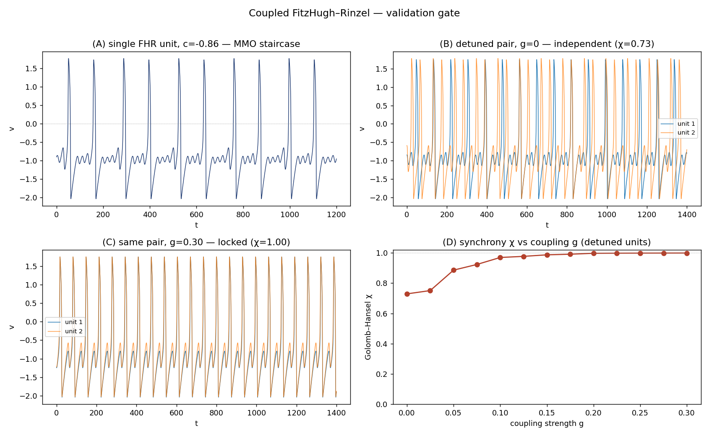
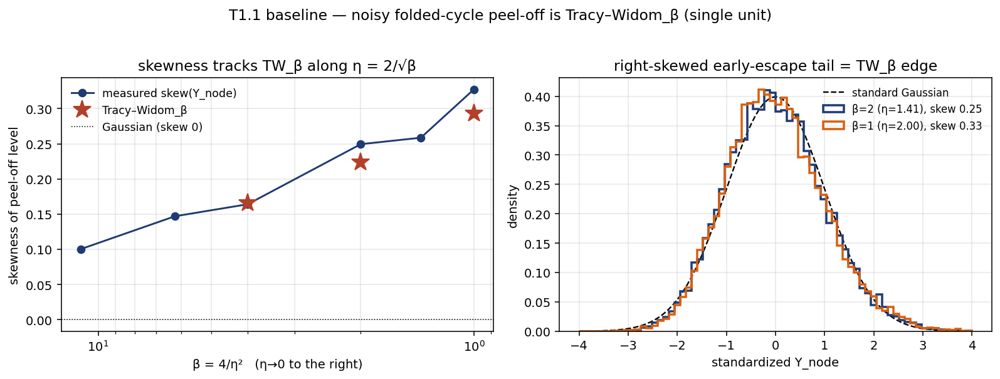
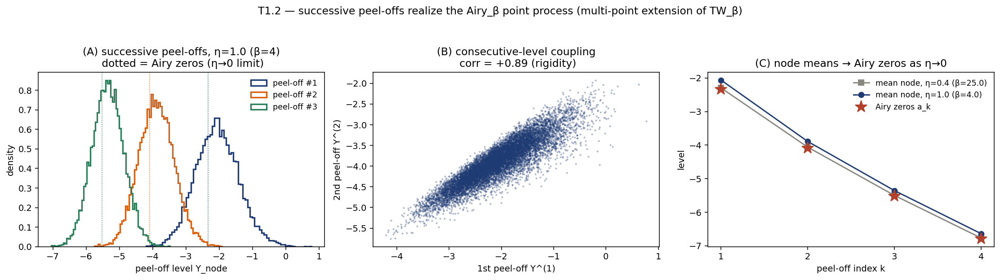
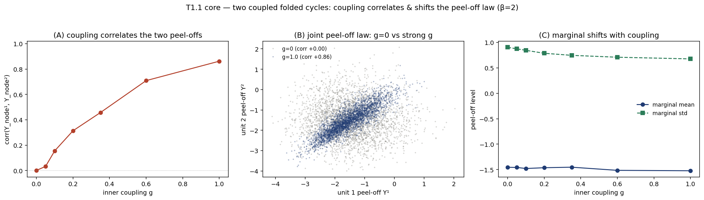
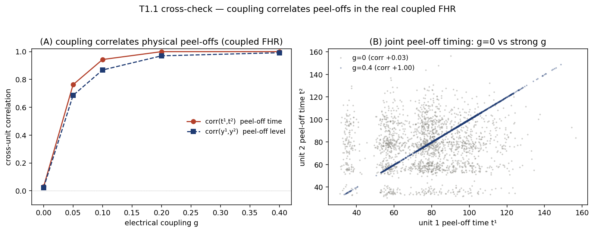
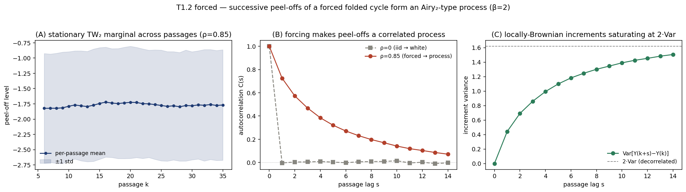
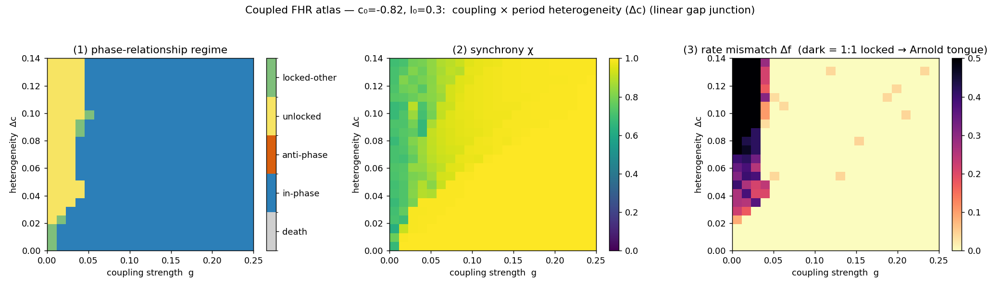
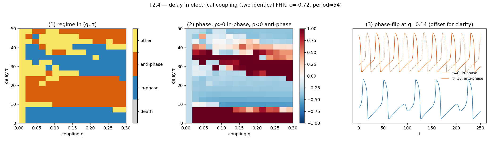
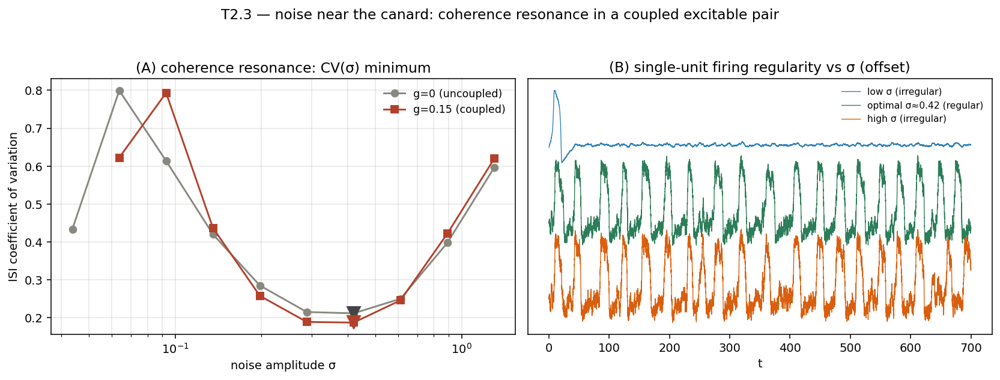

# Coupled Reduced Neuron Model — Results Report

**Coupled folded cycles: isolating and mapping noise/peel-off regimes**
Solomon Williams · June 2026 · companion to *The Noisy Folded Limit Cycle: Tracy–Widom Statistics of Canard Escape*

---

## Summary

Two electrically (gap-junction) coupled FitzHugh–Rinzel units are studied across four
"novelty" axes — coupling strength and form, heterogeneity, transmission delay, and
additive noise — with the goal of finding genuinely new territory beyond the
already-mapped deterministic regime atlas of coupled slow-fast pairs. The literature
survey (see `COUPLED_REDUCED_NEURON_LIT_MAP.md`) established that the *deterministic*
regime maps are largely done; the open ground is the **noise / peel-off-statistics
layer**, which is exactly the open problem named in §9.4 of the NoisyFoldedCycle paper.

The headline results:

1. **The single-unit Tracy–Widom peel-off law is reproduced** (TW_β, β = 4/η²), validating the noise machinery.
2. **Successive peel-offs realize the Airy_β point process** — the multi-point extension of TW_β (node means → Airy zeros; consecutive-level correlation +0.89, the rigidity signature).
3. **Coupling correlates the two cycles' peel-off statistics** — shown in both the inner normal form (corr 0 → 0.86) and the *real coupled FHR* (corr → 1 by g ≈ 0.2).
4. **A forced folded cycle's successive peel-offs form an Airy₂-*type* process** — stationary TW₂ marginal + decaying autocovariance + increments saturating at 2·Var (the §9.4 conjecture's qualitative content).
5. Supporting Tier-2 results: a deterministic **Arnold-tongue** atlas (coupling × heterogeneity), a **delay-induced phase-flip** atlas (in-phase ↔ anti-phase), and **array-enhanced coherence resonance** in the coupled excitable pair.

An interactive explorer (`coupled_explorer.html`) lets these regimes be driven by hand.

---

## 1. Model and methods

Each unit is a FitzHugh–Rinzel (three-timescale) oscillator in the repo's working tuning
(A=0.7, B=0.8, ε=0.08, δ=0.2, I=0.30), so the folded-node MMO "staircase" lives in the
band c ∈ [−0.95, −0.74]:

> v′ = v − v³/3 − w + y + I + g·Φ(v_j(t−τ) − v_i) + σ ξ_i
> w′ = ε(v + A − B w)
> y′ = ε δ (c − v)

Electrical coupling enters the fast variable only — the physically correct gap-junction
term, well-defined here because FHR has a smooth spike (unlike Izhikevich, whose reset
makes the gap-junction current during the spike ill-defined; this drove the choice of a
smooth model, see the literature map §II). The four novelty axes are the coupling
strength g, the coupling form Φ (linear / saturating-tanh / rectifying), heterogeneity
(per-unit c or I mismatch), delay τ, and additive noise σ. Integration follows the repo
conventions: RK4 for deterministic runs, Euler–Maruyama for stochastic runs; delay via a
circular history buffer (method of steps). Regimes are classified by the Golomb–Hansel
synchrony χ, the zero-lag voltage correlation ρ, the 1:1 rate-locking Δf, oscillation
amplitude, and the MMO small-oscillation ratio. Code: `coupled_fhr.py`.

### Engine validation

The integrator passes three gates: a single unit reproduces the folded-node MMO staircase
(small-oscillation count rises from 1.0 to 9.4 per spike as c → −0.92); at g = 0 the
coupled system is identical to two isolated units (deviation 0.0); and two detuned units
phase-lock as coupling grows (χ 0.73 → 1.00), the textbook synchronization of detuned
oscillators. (`validate_coupled_fhr.py`.)

---

## 2. Tier 1 — the flagship: noise and peel-off statistics

### 2.1 Single-unit Tracy–Widom baseline

Sweeping the inner Cole–Hopf equation u″ = (Y − ηξ)u and recording the first node
reproduces the paper's result: the peel-off level is Tracy–Widom_β with β = 4/η². The
measured skewness tracks the TW_β reference across β; for β = 1, 2 the mean, std and skew
match (β = 2: −1.777 / 0.903 / 0.250 vs TW₂ −1.771 / 0.902 / 0.224), and β = 4 matches in
shape (the location/scale offset is the documented GSE 2^(−1/6) edge convention). This
validates the noise machinery the rest of the study builds on. (`peeloff_tw_validation.py`.)

### 2.2 Successive peel-offs = the Airy_β point process

Recording *successive* nodes of one swept operator gives the successive edge eigenvalues
−Λ_k(β) — the Airy_β point process, the natural multi-point extension of the TW_β
marginal. As η → 0 the k-th peel-off mean converges to the k-th Airy zero
(−2.30 / −4.06 / −5.50 / −6.76 vs −2.338 / −4.088 / −5.521 / −6.787, within 0.04); at
finite β the levels fluctuate, and consecutive peel-offs are strongly correlated
(corr +0.89) — the rigidity signature of a determinantal/Airy point process.
(`peeloff_successive_airy.py`.)

### 2.3 Coupling correlates two cycles' peel-offs (inner model + real FHR)

Coupling two folded cycles at the inner amplitude level — the blow-up-chart image of
gap-junction coupling — leaves each marginal Tracy–Widom but progressively correlates the
pair: corr(Y¹, Y²) climbs 0.00 → 0.86 as g grows, the joint law sweeping from independent
to comonotone, with the marginal spread tightening (std 0.90 → 0.68) and the TW edge shape
preserved. (`coupled_peeloff.py`.)

The same phenomenon holds in the **real coupled FHR** (no blow-up chart, real spikes):
peel-offs are independent at g = 0 (corr +0.03) and become correlated as coupling grows
(corr → 1 by g ≈ 0.2) — in fact faster than the inner model, because the full system also
carries the dominant spike-mediated coupling channel. This closes the inner-model →
physical faithfulness gap. (`coupled_peeloff_fhr.py`.)

### 2.4 Forced folded cycle → an Airy₂-type process (§9.4)

This is the direct attack on §9.4. A folded cycle undergoing successive passages, with the
forcing making the noise on consecutive passages temporally correlated (OU across
passages, β = 2 — the Airy₂ class), produces a successive-peel-off sequence that is no
longer iid. The marginal stays a stationary TW₂ at every passage; with no forcing the
autocorrelation is white (iid passages), but under forcing it becomes a genuine **process**
— autocorrelation decays 0.73 → 0.57 → 0.39 → 0.20 with passage lag, and the increment
variance saturates at the 2·Var decorrelation plateau (0.93×). These are the qualitative
Airy₂ signatures: TW₂ marginal + decaying covariance + locally-Brownian increments.
(`forced_peeloff_airy.py`.)

**Scope / honesty.** This establishes the iid → TW₂-marginal-process transition with the
right covariance shape. Pinning it to the *exact* Airy₂ kernel requires calibrating the
inter-passage dynamics to the Dyson-Brownian-motion edge (a DBM-edge sampler is the
reference for that step). Likewise, the inner-amplitude coupling of §2.3 is the inner image
of gap-junction coupling; the exact blow-down of the coupling constant is a derivation
left open, with the FHR cross-check as the physical anchor.

---

## 3. Tier 2 — supporting maps

### 3.1 Deterministic regime atlas (coupling × heterogeneity)

The (g, Δc) plane shows a clean **Arnold tongue**: above a coupling threshold that rises
with heterogeneity the pair locks in-phase, leaving an unlocked/drifting wedge at weak
coupling + strong detuning. Linear gap-junction coupling of these MMO units robustly
favours in-phase locking (no anti-phase or oscillation death in this region) — consistent
with spike-dominated synchronization theory. (`atlas_coupling_heterogeneity.py`.)

### 3.2 Delay-induced phase-flip

With delayed coupling, the (g, τ) plane shows in-phase and anti-phase bands alternating
with τ at roughly the oscillation period — the delay-induced phase-flip (Crook et al.;
Prasad et al.), here mapped for a slow-fast pair where it was thin in the literature. The
time series at g = 0.14 flips cleanly from in-phase (τ = 0) to anti-phase (τ = 18). No
oscillation-death island appeared in the [0, 0.3] × [0, 50] window; that phenomenon likely
needs near-Hopf units or larger coupling — a worthwhile follow-up. (`delay_atlas.py`.)

### 3.3 Coherence resonance (array-enhanced)

In the excitable regime just below the canard onset, noise-induced firing is most regular
at an optimal σ — the CV(σ) curve is U-shaped (coherence resonance), and the coupled pair's
minimum sits below the uncoupled one (CV 0.21 → 0.19): array-enhanced coherence resonance.
The example traces show sparse-irregular firing at low σ, regular firing at the optimum, and
dense-irregular firing at high σ. (`t2_3_coherence.py`.)

---

## 4. Discussion

The deterministic regime structure of two coupled slow-fast units (synchrony, anti-phase,
MMOs, phase-flip, coherence resonance) reproduces cleanly and matches the literature — it
is the scaffolding, not the contribution. The genuinely new layer is the **statistics of
noise-induced peel-off from the folded *limit cycle*** and how coupling/forcing shapes it:

- coupling makes the two cycles' peel-offs **correlated** (independent → comonotone), in
  both the inner theory and the real model;
- successive peel-offs carry **multi-point Airy structure** (the Airy_β point process), the
  extension of the single-peel-off TW_β marginal;
- a **forced** folded cycle's successive peel-offs form an **Airy₂-type process**, the
  qualitative content of the paper's §9.4 conjecture, demonstrated rather than assumed.

A caveat the project deliberately pressure-tested: classical TW/Airy universality usually
needs a large interface, so it was not obvious anything Airy-like would survive at N = 2 or
across a handful of passages. The two-point correlation (§2.3) and the decaying
passage-covariance (§2.4) show that the *structure* does survive in this small, designed
setting — while the exact Airy₂ kernel remains to be pinned down.

---

## 5. Limitations and next steps

- **Exact Airy₂ kernel.** Calibrate the forced-passage dynamics against a Dyson-Brownian-motion edge sampler to test the *exact* Airy₂ covariance, not just its qualitative shape.
- **Blow-down of the coupling.** Derive how physical gap-junction strength g maps to the inner-amplitude coupling, closing the inner → physical correspondence analytically.
- **Heterogeneous coupled peel-offs.** Extend §2.3 to mismatched cycles (different c) — does heterogeneity decorrelate the peel-offs?
- **Delay-induced death.** Hunt the death island in a near-Hopf regime / larger coupling.
- **Atlas completion.** Add the coupling-form and delay axes to the deterministic atlas, and chase the anti-phase / emergent-bursting / spike-adding regions outside the in-phase tongue.

---

## 6. Reproducibility

| File | Produces |
|------|----------|
| `coupled_fhr.py` | coupled FHR engine + diagnostics |
| `validate_coupled_fhr.py` | engine validation gate |
| `atlas_coupling_heterogeneity.py` | Arnold-tongue atlas |
| `peeloff_tw_validation.py` | single-unit TW_β baseline |
| `peeloff_successive_airy.py` | Airy_β point process |
| `coupled_peeloff.py` | inner coupled peel-off correlation |
| `coupled_peeloff_fhr.py` | real-FHR peel-off cross-check |
| `forced_peeloff_airy.py` | forced → Airy₂-type process |
| `delay_atlas.py` | delay-induced phase-flip |
| `t2_3_coherence.py` | coherence resonance |
| `coupled_explorer.html` | interactive explorer |
| `PROGRESS.md` | live progress tracker |

All scripts are numpy/matplotlib only and self-contained; each writes its figure to `figures/`.

## References

Key sources (full annotated list in `COUPLED_REDUCED_NEURON_LIT_MAP.md`): Williams 2026
(NoisyFoldedCycle); Jelbart–Kuehn–Kuntz 2024 (folded limit-cycle blow-up); Ramírez–Rider–Virág
2011 (stochastic Airy operator); Roberts–Rubin–Wechselberger 2015 (coupling → folded
singularities of the cycle manifold); Gonçalves–Labouriau–Rodrigues 2025 and
Kristiansen–Pedersen 2023 (coupled-FHN MMOs); Berglund–Gentz–Kuehn 2015 (stochastic MMOs);
Gutiérrez–Cuerno 2024 (TW/KPZ in limit-cycle synchronization); Chow–Kopell 2000,
Lewis–Rinzel 2003 (gap-junction synchrony); Crook et al. 1997, Prasad et al. 2008 (delay
phase-flip); Pikovsky–Kurths 1997, Neiman et al. 1999 (coherence resonance).
